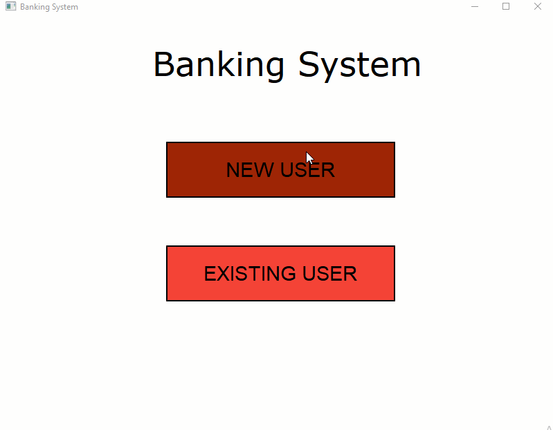

# Banking System
A GUI Application built with the QT framework that implements OOP concepts learning in Programming II and a SQLite database. Displayes a UI that allows users to register/login to an account and manage their checking and savings account. User data is saved to an SQLite Database.

# OOP Concepts
The following concepts are implemented in this project:
* [x] Design and implement a class.

  - See "user.h"
* [x] Use subclassing to design simple class hierarchies that allow code to be reused for distinct subclasses.

  - See "customer.h"
* [x] Correctly reason about control flow in a program using dynamic dispatch. 

  - See "interface.h"
* [x] Explain the relationship between object-oriented inheritance (code-sharing and overriding) and subtyping (the idea of a subtype being usable in a context that expects the supertype). 

  - See "checkingaccount.h"
* [x] Use object-oriented encapsulation mechanisms such as interfaces and private members.

  - See "interface.h"
* [x] Define and use iterators and other operations on aggregates, including operations that take functions as arguments. 

   - See "iterators.cpp"
* [ ] Follow best practices for style and readability.
* [ ] Follow best practices for documentation.

# Work-in-Progress Demo

# Built with
- C++ 
- QT
- QT-Creator IDE (version 5.0.2 community)
