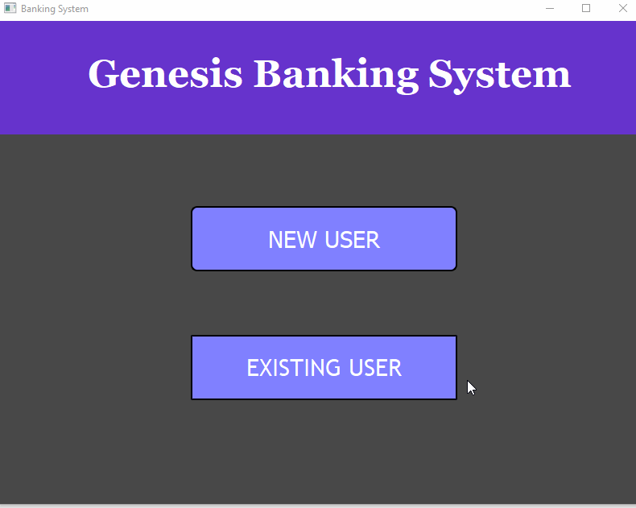

# Banking System
A GUI Application built with the QT framework that implements OOP concepts learning in Programming II and a SQLite database. Displays a UI that allows users to register/login to an account and manage their checking and savings account. User data is saved to an SQLite Database.

# OOP Concepts
The following concepts are implemented in this project:
* [x] Design and implement a class.

  - See "user.h"
* [x] Use subclassing to design simple class hierarchies that allow code to be reused for distinct subclasses.

  - See "customer.h"
* [x] Correctly reason about control flow in a program using dynamic dispatch. 

  - See "interface.h"
* [x] Explain the relationship between object-oriented inheritance (code-sharing and overriding) and subtyping (the idea of a subtype being usable in a context that expects the supertype). 

  - See "checkingaccount.h"
* [x] Use object-oriented encapsulation mechanisms such as interfaces and private members.

  - See "interface.h"
* [x] Define and use iterators and other operations on aggregates, including operations that take functions as arguments. 

   - See "iterators.cpp"
* [x] Follow best practices for style and readability.
* [x] Follow best practices for documentation.

# Project Demo

# Class Diagram 

# Style/Structure
Used Qt Creator's Clang-Tidy and Clazy code analyzer:

Results:

# Getting Started
First, download QT Creator: https://www.qt.io/download-qt-installer?hsCtaTracking=99d9dd4f-5681-48d2-b096-470725510d34%7C074ddad0-fdef-4e53-8aa8-5e8a876d6ab4

On this github page, press the green "Code" button. Click "Download ZIP". When the file is downloaded, extract the file, and open that folder with QT Creator.

Alternatively, you can download QT Creator, and then git clone the repo and open with QT Creator.

# Built with
- C++ 
- QT
- QT-Creator IDE (version 5.0.2 community)

# Resources
Udemy Course: QT C++ GUI Tutorial For Beginners by Yogesh Patel: https://www.udemy.com/course/qt-c-gui-tutorial-for-beginners/

Beginner SQLite Tutorials by ProgrammingKnowledge: https://www.youtube.com/watch?v=U7nfe4adDw8&list=PLS1QulWo1RIa0-Cs2Qx6GFyiIVVVS9lCS

DB Browser (SQLite) - open source tool to create, design, and edit database files compatible with SQLite: https://sqlitebrowser.org/

